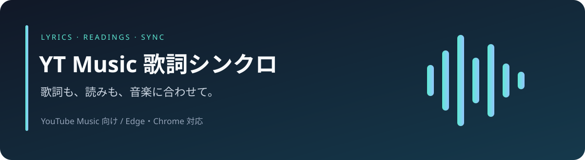

# YT Music 歌詞シンクロ 2.7.19-beta.6

Music Glass v1.2.7の背景・角丸テーマを組み込んだ試用版です。

[ベータ版の使い方と注意点](docs/MUSIC-GLASS-BETA.md)

<div align="center">



**YouTube Musicに、追いかけやすい歌詞と読み仮名を。**


[](LICENSE)

[**📦 ダウンロード**](https://github.com/taruYDK/ytm-lyrics-sync/releases) · [**🚀 インストール**](#インストール) · [**📖 使い方**](#使い方) · [**📝 変更履歴**](CHANGELOG.md) · [**💬 不具合・要望**](https://github.com/taruYDK/ytm-lyrics-sync/issues)

</div>

---

## できること

| | 機能 | 内容 |
| :---: | :--- | :--- |
| 🟢 | **歌詞を追跡** | 再生に合わせて行・単語をハイライト。「なめらか」「ぬるぬる」の表示に対応。 |
| 🔵 | **読み仮名を表示** | 漢字にひらがな、英語にカタカナ。読みも本文と一緒に追跡。 |
| 🟣 | **自分の読みに修正** | 行ごとのふりがな編集・保存。日本語と英語は別々にON/OFF。 |
| 🟠 | **同期ずれを調整** | 0.1秒単位の補正と、曲の途中からの細かなタイミング調整。 |
| 📝 | **歌詞を編集・作成** | LRCの読み込み、歌詞編集、同期歌詞作成、LRC書き出し。 |
| 💾 | **保存して引き継ぐ** | 歌詞候補の固定、曲別設定、手動読みのバックアップ・復元。 |

> YouTube Music向けの非公式拡張機能です。YouTube・Google・Microsoftおよび各歌詞提供元とは関係ありません。

## インストール

**Edge / Chromeで使用できます。Chromeは111以降が必要です。**

1. [Releases](https://github.com/taruYDK/ytm-lyrics-sync/releases)から配布ZIPをダウンロードし、展開します。
2. Edgeは `edge://extensions`、Chromeは `chrome://extensions` を開きます。
3. **開発者モード**をONにします。
4. **展開して読み込み**を選び、`manifest.json` があるフォルダーを指定します。
5. YouTube Musicのタブを再読み込みします。

利用するだけならNode.jsやビルドは不要です。配布ZIPがまだない場合は、リポジトリの **Code → Download ZIP** からソース一式を展開し、その中の `extension` フォルダーを指定して読み込めます。

### すでに使っている場合

**拡張機能を削除せず、読み込み済みフォルダーの中身を更新してください。**

1. ポップアップの「データ保護」からバックアップを保存します。
2. 新版を展開し、現在読み込んでいるフォルダーへ上書きします。
3. 拡張機能の管理画面で「再読み込み」を押します。
4. YouTube Musicを `Ctrl+R` で再読み込みします。

この方法で曲別補正・歌詞編集・固定候補・ローカル歌詞・手動読みを引き継げます。拡張機能を削除すると、ブラウザー内の保存データも削除されます。

## 使い方

| やりたいこと | 操作する場所 |
| :--- | :--- |
| 歌詞を選ぶ・固定する | 歌詞タブの **歌詞候補** → 候補を選択 → **📌 この歌詞を固定** |
| ふりがなを書き直す | **その他 → ふりがな編集** → 行を選択 → 読みを編集 → **この行を保存** |
| ふりがなを消す・元に戻す | 読みを空欄で保存／**この行を自動読みに戻す** |
| 自分のLRCを読み込む | **その他 → 歌詞を追加** |
| 歌詞の文章を直す | **その他 → 歌詞編集** |
| 同期歌詞を作る | **歌詞を追加 → ♪ 同期歌詞作成モード**で歌い始めを記録 |
| 歌詞のタイミングを合わせる | 再生バーの **歌詞 ±0.0秒** |
| 表示位置・自動復帰を変える | 拡張機能のポップアップ → **歌詞追跡** |
| データを保存・復元する | 拡張機能のポップアップ → **データ保護** |

<details>
<summary><strong>🔵 読み仮名について</strong></summary>

漢字のひらがなと英語のカタカナは、設定の「読み仮名」で別々にON/OFFできます。初期状態は両方ONです。

- 例：今日 → **きょう** ／ Hello → **ハロー** ／ love → **ラブ**
- 辞書は同梱しており、読みの生成のために歌詞を外部へ送信しません。
- 英語は発音の目安です。固有名詞・歌詞独自の読みなどは、手動で修正してください。
- 未知語や4,000文字を超える行では、自動読みを省略します。
- 本文と読みの送り仮名・空白が一致しない場合、手動読みの位置は近似になります。
- 候補切り替え時は本文と出現順で照合します。本文や繰り返し回数の変更には完全には追従できません。

読み仮名は表示専用です。歌詞本文・同期時刻・LRC出力には混ぜません。

</details>

<details>
<summary><strong>🟠 追跡・同期を細かく調整する</strong></summary>

| 設定 | 範囲・動作 |
| :--- | :--- |
| 追跡位置 | 上から25〜65%、標準42%。冒頭の位置は従来通り。 |
| 手動スクロール後の復帰 | 1・2・3.5・5・10秒。標準3.5秒。 |
| 同期補正 | 0.1秒単位、最大±20秒。曲の途中の補正ポイントも設定可能。 |
| 画面サイズ変更 | 歌詞領域に合わせて再配置。手動スクロール中は復帰時間を優先。 |

追跡位置・復帰時間は操作停止から500ミリ秒後に保存します。その他の設定は即時保存です。「保存しました」の表示を確認してください。

</details>

## 保存データとプライバシー

バックアップには、表示設定・曲別補正・手動検索条件・歌詞編集・固定候補・ローカル歌詞・手動ふりがなを含めます。通常の歌詞キャッシュと認証情報は含めません。

歌詞検索では、曲名・アーティスト名などの情報を有効な歌詞提供元へ送信します。自分で追加・編集した歌詞や手動読みは外部へ送信しません。認証通信を含む詳細は [PRIVACY.md](docs/PRIVACY.md) を参照してください。

## 更新情報

**v2.6.3**：歌詞の指定検索を並行して開始し、採用済み歌詞を早めにキャッシュへ保存するよう改善しました。

詳しくは [CHANGELOG.md](CHANGELOG.md) を参照してください。

## 開発・不具合報告

Node.js 20以降。外部パッケージのインストールは不要です。

```sh
npm run build
npm run check
```

`src/` を編集したら `extension/content.js` を再生成してください。v2.6.5では自動テスト72件と生成物一致を確認しています。実サイトでの表示・外部APIの動作は、このテストの保証範囲に含まれません。

[開発ガイド](docs/DEVELOPMENT.md) · [変更時の手順](.github/CONTRIBUTING.md) · [不具合・要望](https://github.com/taruYDK/ytm-lyrics-sync/issues)

不具合報告には、バージョン・再現手順・必要に応じて曲URLと診断情報を添えてください。

## ライセンス

本体は [MIT License](LICENSE)。同梱辞書・ライブラリーには個別のライセンスが適用されます。[第三者ライセンスと出典](extension/vendor/README.md)を確認してください。


### v2.6.2の負荷軽減
日本語辞書を共有Workerへ移動し、未使用5分で解放します。保存処理を集約し、プレイヤー通信は約30Hz、拡張OFF時は停止します。offscreen権限を追加しました。実ブラウザーでの負荷測定は未実施です。

### YouTube Music本体の歌詞
YouTube Music本体の行同期歌詞を動画IDで取得する候補を追加しました。提供元設定からON/OFF可能です。ログイン情報は使用しません。認証が必要な歌詞や別音源の探索には未対応です。

## v2.6.4

歌詞クリック後もSpaceで再生・一時停止できます。クリックとEnterは歌詞位置へ移動します。長押しでの連続切り替えを防止。テスト71件成功（実機未確認）。

## 📁 ファイル構成

| フォルダー | 内容 |
| --- | --- |
| `extension/` | ブラウザーに読み込む拡張機能本体 |
| `src/` | 歌詞表示などの開発用ソース |
| `tests/` | 自動テスト |
| `scripts/` | ビルド・配布用コマンド、辞書生成データ |
| `docs/` | 開発手順・公開手順・プライバシー説明 |

開発時は `npm run build`、確認は `npm run check`。`npm run package` で配布用フォルダーを `dist/` に生成します。配布ZIPはそのフォルダーの中身を圧縮してください。ZIP直下に `manifest.json` が入る構成です。

配布ZIPは `npm run package` による生成物一致確認と全自動テストの成功後に作成します。開発用ソースとテストは配布ZIPには含めません。

## v2.7.0 操作と状態表示の改善

- 歌詞の検索中・取得済み・同期歌詞なしを提供元とともに表示。
- 手動スクロール後の待機中に「今の歌詞に戻る」を表示。
- ふりがな編集に、実際の配置処理を使う入力プレビューを追加。
- 歌詞編集・手動ふりがな・同期補正の保存後60秒間、「元に戻す」で直前の変更を取り消し。他タブで更新された内容は上書きしません。曲切り替え・ページや拡張機能の再読み込み後は利用できません。
- その他メニューを「歌詞を探す」「編集する」「保存・診断」に整理。無効な項目の理由を表示。

画面幅1100px以下では、歌詞の再同期・補正は「その他」メニューから操作できます。
